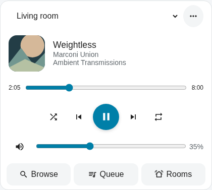

# Music Assistant Card

A theme-aware Home Assistant card for music discovery, playback, and multiroom control. Built with strict TypeScript and Lit. All dependencies ship in one local JavaScript module.



[Dark theme preview](docs/player-dark.png) · [Standard and compact layouts](docs/cards-light.png)

## Install

1. Build with Node.js 20.19+ and `npm ci && npm run build`, or use the included `ha-music-assistant-card.js`.
2. Copy that module into Home Assistant's `/config/www/` directory.
3. Add `/local/ha-music-assistant-card.js` as a **JavaScript module** dashboard resource.
4. Add **Music Assistant** from the card picker, select your Music Assistant player entities, and save.

```yaml
type: custom:ha-music-assistant-card
entities:
  - media_player.living_room
```

Music Assistant Server and the official Home Assistant Music Assistant integration must already be configured. Use the Music Assistant versions of player entities. The card detects available services; missing optional capabilities do not prevent playback.

This subproject includes HACS metadata for a future standalone repository. It has not been published to HACS. Its generated bundle is an installation artifact, not a declaration that live-device release validation has passed.

## Capabilities

| Feature                                                      | Official integration                    | With optional `mass_queue`       |
| ------------------------------------------------------------ | --------------------------------------- | -------------------------------- |
| Transport, seeking, shuffle, repeat, mute                    | Player capabilities                     | Same                             |
| Individual/group volume, ceilings, alternate volume entities | Yes                                     | Same                             |
| Group/ungroup and room presets                               | Compatible players only                 | Same                             |
| Queue transfer                                               | Same Music Assistant instance           | Same                             |
| Search, library, favorites, recently played library items    | Available native services               | Same                             |
| Play now/next, append, replace, radio mode                   | Native play-media action                | Same                             |
| Queue display                                                | Current and next                        | Full queue, paged                |
| Queue jump, move, remove                                     | Unavailable                             | Available services               |
| Clear queue                                                  | Exposed in full queue UI when supported | Native clear-playlist action     |
| Album/artist children                                        | Native browse-media                     | Richer detail/track services     |
| Playlist tracks and podcast episodes                         | Playable collection                     | Extension track/episode services |
| Favorite current song                                        | Discovered button or explicit override  | Same                             |
| Metadata, provider, audio quality                            | Fields actually returned                | Richer metadata where supplied   |

Install [Music Assistant Queue Actions](https://github.com/droans/mass_queue) separately to enable optional features. Availability is checked against both registered services and the selected player's mapped extension instance. Cross-provider grouping remains a Music Assistant/player capability, not something the card can create.

## Configuration

The visual editor supports all card-specific options below. It preserves unrecognized keys for Home Assistant layout settings and future extensions. Empty required fields remain local editor drafts until valid.

```yaml
type: custom:ha-music-assistant-card
layout: auto
entities:
  - entity_id: media_player.living_room
    name: Living room
    max_volume: 65
    # Optional separate amplifier volume control:
    volume_entity: media_player.living_room_amplifier
    # Optional overrides if registry discovery is unavailable:
    # config_entry_id: music_assistant_entry_id
    # favorite_entity: button.living_room_favorite_now_playing
  - entity_id: media_player.kitchen
    name: Kitchen
    max_volume: 50
default_player: media_player.living_room
sections: [browse, queue, rooms]
artwork_size: medium
metadata: true
artwork_accent: false
extension: auto
room_presets:
  - name: Downstairs
    leader: media_player.living_room
    members:
      - media_player.kitchen
```

| Option            | Default            | Values/meaning                                                    |
| ----------------- | ------------------ | ----------------------------------------------------------------- |
| `entities`        | Required           | Ordered list of entity IDs or room objects                        |
| `default_player`  | First entity       | Initial room, independently selected per card                     |
| `layout`          | `auto`             | `auto`, `compact`, `standard`, `expanded`                         |
| `sections`        | All three          | Ordered, unique `browse`, `queue`, `rooms`; `[]` hides navigation |
| `artwork_size`    | `medium`           | `small`, `medium`, `large`                                        |
| `metadata`        | `true`             | Album and detail presentation                                     |
| `artwork_accent`  | `false`            | Subtle static background tint; text retains theme colors          |
| `extension`       | `auto`             | Detect optional extension, or `off`                               |
| `config_entry_id` | Registry discovery | Default native integration entry override                         |
| `room_presets`    | `[]`               | Name, leader, and members, all from configured rooms              |

Room objects accept `entity_id`, `name`, `volume_entity`, `max_volume` (0–100), `config_entry_id`, and `favorite_entity`. Volume ceilings constrain commands issued by this card; other clients can exceed them. Group-volume adjustments set each member to the selected absolute percentage, respecting configured ceilings. Presets add their members and preserve existing membership. Failed rooms are reported individually; successful joins are not undone.

Selecting a room changes only this card's control target. **Join playback** groups it with the selected room. **Move playback here** transfers the selected room's queue to the destination.

## Layout behavior

| Preset          | Default Sections allocation | Minimum |
| --------------- | --------------------------- | ------- |
| Compact         | 6 columns × 2 rows          | 6 × 2   |
| Standard / Auto | 12 × 6                      | 6 × 4   |
| Expanded        | 12 × 8                      | 6 × 4   |

User-selected Home Assistant grid dimensions take precedence. Short allocations collapse secondary controls into the player dialog. Expanded cards split at 720px **card width**, not screen width. Search, room controls, queue, and details use accessible dialogs in smaller cards without increasing dashboard height. Long content scrolls within its panel. Masonry uses measured card height. Panel views and stacks use their parent's allocated space.

Native search returns at most 50 results for the selected media type; refine the query for more. Empty searches browse library collections in 25-item pages. The queue extension pages 50 items at a time. Artist and podcast child lists use the extension's non-paginated endpoints. Metadata is supplied by Music Assistant: no third-party account, token, or metadata subscription is stored by the card.

## Development and validation

```sh
npm ci
npm run check
npx playwright install --with-deps chromium firefox webkit
npm run test:browser
npm run format:check
```

`check` runs strict typechecking, ESLint, unit/adapter/controller tests, and the production bundle. Browser tests use a deterministic Home Assistant fixture, including a small icon stub, and exercise Chromium, Firefox, and WebKit. Screenshots are generated from that fixture; they are not screenshots of a live Home Assistant installation. For visual development, run `node tests/browser/server.mjs` and open `http://127.0.0.1:4187` after building.

Architecture: `adapters/` contains authenticated native/extension API calls; normalization and configuration are pure functions; the controller owns asynchronous state and lifecycle; Lit elements render it. Native action contracts are checked against Home Assistant's service implementations, including flat search and pagination fields. Queue subscription is optional; a 15-second fallback runs only while a visible queue is open. Queries ignore stale responses and caches are bounded to the card session. Mutations are never automatically retried.

Before a public release, complete the [live validation checklist](docs/LIVE_VALIDATION.md). Actual Music Assistant speakers and companion-app WebViews cannot be simulated by Playwright fixtures.

## Troubleshooting

- **Card not found:** confirm resource type is module, then refresh the browser cache. Use a version query string on the resource URL after updates.
- **No search/library:** confirm the official integration exposes the relevant actions and select an MA player rather than its original duplicated entity.
- **Registry permission error:** supply the native integration `config_entry_id`; use `favorite_entity` if favorite-button discovery is restricted.
- **Only current/next:** the extension is absent, disabled, or does not map this player. Native queue details are deliberately not presented as a full queue.
- **Grouping rejected:** confirm the player/provider supports grouping; check Music Assistant for compatible group members. Inspect the room-specific error before trying again.
- **Missing art:** verify artwork can be reached from the browser, including remote HTTPS access. Unsafe URLs are rejected. Cross-origin color extraction may fail safely while artwork still displays.
- **Unavailable room:** the row remains visible; playback actions are disabled until Home Assistant reports it available.

Spectrum analysis, audio capture, animated effects, and a companion backend are intentionally excluded from this version.

See [third-party notices](THIRD_PARTY_NOTICES.md) for the MIT-licensed upstream behavior adapted from `droans/mass-player-card`.
